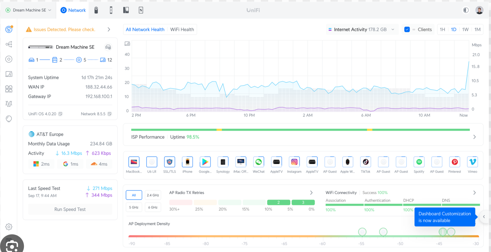

# ネットワーク監視ダッシュボード 設計メモ

## 目的

ネットワーク内のサーバーでホストする自作の監視ダッシュボード。
UniFi Network Application に近い見た目・機能を持つ Web UI を自作する。



---

## ネットワーク構成

```
Internet (BIGLOBE)
    |
[router1 (IX2215-1)]  GE1.0: WAN (DHCP, NAPT)
    |  GE2.0: 192.168.1.1/24 --- SW1 --- LAN1クライアント
    |  GE0.0: 10.0.0.1/30
    |          (直結リンク)
    |  GE0.0: 10.0.0.2/30
[router2 (IX2215-2)]
    |  GE2.0: 192.168.2.1/24 --- SW2 --- LAN2クライアント
```

- LAN2クライアントはrouter2 → router1 → BIGLOBE でインターネットに出る
- router2にNAPTなし、router1のNAPTで一括処理

---

## 表示したい機能

| 機能 | 内容 |
|------|------|
| 接続デバイス一覧 | IPアドレス・MACアドレス・ホスト名・所属LAN |
| 帯域グラフ | WAN/LANインターフェースのin/out帯域履歴 |
| Ping監視グラフ | 応答時間の時系列グラフ・成功率 |
| システム情報 | WAN IP・Uptime・ゲートウェイ |

---

## 技術スタック

### データ収集

| ツール | 役割 |
|--------|------|
| Telegraf | 収集エージェント (SNMP, ping, スクリプト入力) |
| InfluxDB | 時系列データ保存・クエリ |

#### Telegraf 収集項目

- `inputs.ping` — ターゲットへのping応答時間・成功率
- `inputs.snmp` — ルーターのインターフェース帯域 (ifInOctets / ifOutOctets)
- カスタムスクリプト — DHCPリース or arp-scanで接続デバイス一覧

### ホスト環境

| 項目 | 内容 |
|------|------|
| ハイパーバイザー | Proxmox VE |
| VM OS | Ubuntu Server |
| デプロイ方法 | docker-compose |

### フロントエンド

| ツール | 役割 |
|--------|------|
| Next.js (TypeScript) | フレームワーク |
| shadcn/ui | UIコンポーネント |
| Recharts | グラフ描画 |
| InfluxDB HTTP API | データ取得 (`/api/v2/query`, Flux) |

---

## データフロー

```
[ルーター SNMP]  ──┐
[Pingターゲット] ──┤  Telegraf  ──>  InfluxDB  <──  Next.js  <──  ブラウザ
[DHCPリース]    ──┘
```

---

## InfluxDB クエリ例

```typescript
// Ping履歴
`from(bucket:"network")
  |> range(start: -1h)
  |> filter(fn: (r) => r._measurement == "ping" and r._field == "average_response_ms")`

// 帯域履歴
`from(bucket:"network")
  |> range(start: -1h)
  |> filter(fn: (r) => r._measurement == "interface" and r._field == "bytes_recv")`
```

---

## 今後の課題

- ルーターのSNMP設定 (IX2215でSNMPを有効化する手順)
- 接続デバイス一覧の収集方法確定 (DHCPリース読み取り or arp-scan)
- docker-compose でTelegraf + InfluxDB + Next.js を一括起動
